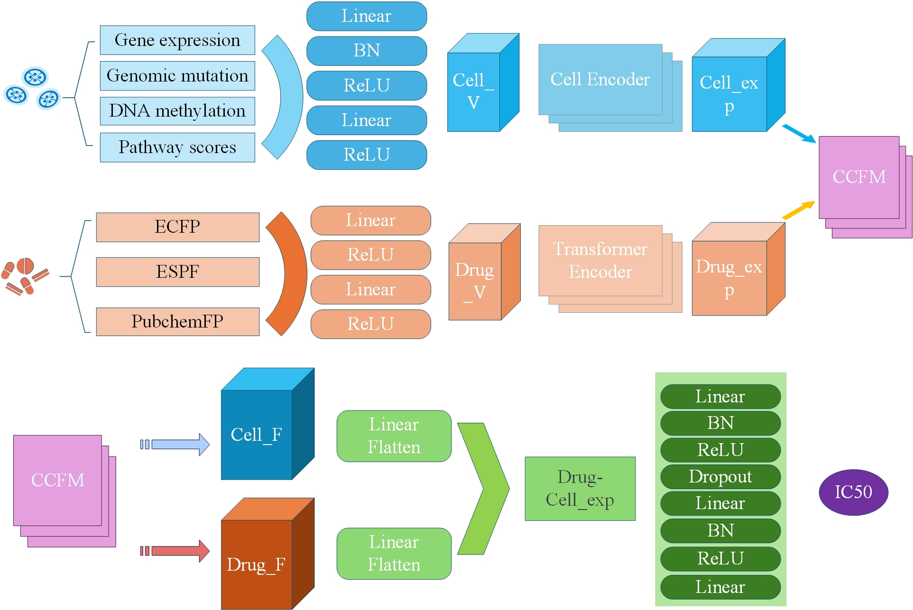

# DCCFM
We propose a drug-cell cross-fusion method (DCCFM) based on attention mechanism for predicting anti-cancer drug response.

  

# Requirements
- python == 3.9
- pytorch == 1.11.0
- numpy == 1.21.5
- scikit-learn == 1.0.2
- pandas == 1.4.1
- rdkit == 2023.3.3
- scipy == 1.7.3

# data
The benchmark dataset is made available herein. Should you wish to access detailed information regarding the raw data, please visit the link: https://github.com/heckletbot/BANDRP

# experiment
1. Set up the Python environment.
2. Run the `main.py` file.
3. Experimental results will be automatically saved to the `result` directory.
